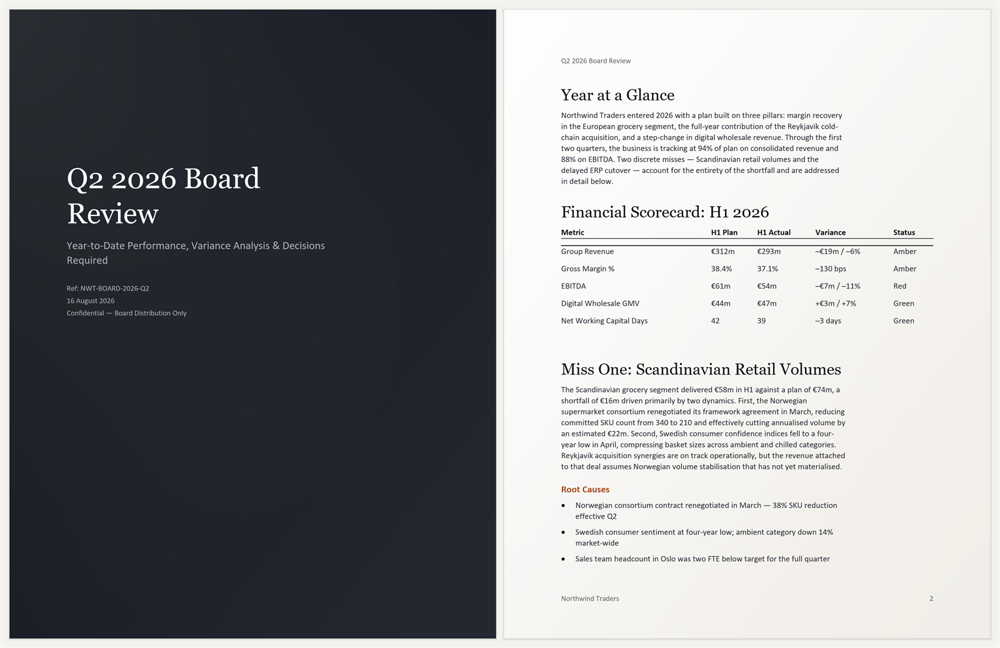

# OfficeAgent.Studio

**A one-line brief in. A PowerPoint deck or a Word report out — one palette, one type
scale, every element on the same margin.**


```bash
git clone https://github.com/ilia-sokolov/OfficeAgent.Studio
cd OfficeAgent.Studio
dotnet run --project src/OfficeAgent.Studio -- deck "Series B narrative for a warehouse robotics company"
```

About a minute later `./output` has a `.pptx`: eight to ten slides, generated from that
one sentence. Needs .NET 8 and either a signed-in [Claude Code](https://claude.com/claude-code)
CLI or a model deployment in Microsoft Foundry.

A sample, in C#, on [OfficeAgent.NET](https://github.com/ilia-sokolov/OfficeAgent.NET) and
the [Microsoft Agent Framework](https://github.com/microsoft/agent-framework).

## What you can make

| Command | Output | Shape |
| --- | --- | --- |
| `both` | deck + report | The default. Same brief, planned independently — the figures will not agree |
| `deck` | `.pptx` | 8–10 slides from seven slide roles |
| `doc` | `.docx` | 12–18 blocks: cover page, headings, bullets, a pull quote, a table |
| `invoice` | `.docx` | Line items, computed totals, payment terms |
| `manual` | `.docx` | Numbered sections and steps that renumber when edited |
| `design-system` | `.json` + preview `.pptx`/`.docx` | Validated reusable system generated from a brand brief |
| `backdrop` | `.pptx` + `.docx` | Background-opacity samples. **Makes no model call** |



**Start with `backdrop`.** It needs no model, no network and no sign-in. If it produces
files, the OfficeAgent document-generation stack and output directory work. A later command
can still fail in model setup, plan validation or content-specific composition, and reports
which stage failed.

```bash
dotnet run --project src/OfficeAgent.Studio -- backdrop
```

`--help` lists everything.

## Why it exists

Ask a model for a deck and you usually get slides that are individually plausible and
collectively a mess. Font sizes drift. A new colour turns up on slide six. Nothing lines up.

That happens because the model was asked to decide two different things at once: what the
document says, and what it looks like. It is good at the first and unreliable at the second,
because looking consistent means making a hundred small decisions identically, ten times
over.

So this splits them. The model returns content as JSON — a slide's role, its title, its one
number — and is told that anything it says about fonts, colours, sizes or positions is
discarded. A composer turns that JSON into OfficeAgent.NET operations, applying
`DesignSystem` as it goes.

Run the same brief twice and you get different words in the same layout.

## Setup

**.NET 8 SDK.** Both projects target `net8.0`. A machine with only a newer SDK can build
this but not run it, and will need the .NET 8 runtime as well.

**A model.** The model client is selected at runtime. By default the sample shells out to the
Claude Code CLI, so if `claude` is installed and signed in there is nothing to configure.
Claude Code needs a paid Claude plan. A run makes one model call per file, and up to three if
the model returns unusable JSON or a plan that violates the documented shape.

To use a Microsoft Foundry deployment instead, set the provider, endpoint and deployment.
With no API key the client uses `DefaultAzureCredential`, which can obtain your Azure CLI,
Visual Studio, service-principal or managed-identity credential:

```powershell
$env:OFFICEAGENT_STUDIO_MODEL_PROVIDER = "azure-foundry"
$env:AZURE_OPENAI_ENDPOINT = "https://your-resource.openai.azure.com/"
$env:AZURE_OPENAI_DEPLOYMENT = "your-chat-deployment"
az login
dotnet run --project src/OfficeAgent.Studio -- deck "Series B narrative"
```

For key-based authentication, also set:

```powershell
$env:AZURE_OPENAI_API_KEY = "your-key"
```

`AZURE_OPENAI_MODEL` is accepted as an alias for `AZURE_OPENAI_DEPLOYMENT`. The endpoint must
be the endpoint shown for the deployed model, and the deployment value is its deployment
name rather than a general catalogue model name. The selected identity needs permission to
invoke it. See Microsoft's [.NET chat quickstart](https://learn.microsoft.com/dotnet/ai/quickstarts/build-chat-app)
and [Foundry authentication guidance](https://learn.microsoft.com/dotnet/ai/azure-ai-services-authentication).

`StudioAgent` still depends only on `IChatClient`. `ModelClientFactory` is the configuration
boundary, so another provider can be added there without changing planning or composition.

**OfficeAgent.NET 0.6.0**, restored from NuGet. NuGet remains the default even when an
OfficeAgent.NET checkout happens to be nearby, so builds do not change with directory layout.
To test deliberately against a sibling checkout, opt in:

```bash
dotnet test -p:UseOfficeAgentSource=true
```

If the checkout is elsewhere, also pass
`-p:OfficeAgentSource=/absolute/path/to/OfficeAgent.NET/src`. The build prints which source
it selected.

You do not need Microsoft Office to generate files — only to open them.

### Environment

| Variable | Default | What it does |
| --- | --- | --- |
| `OFFICEAGENT_STUDIO_OUTPUT` | `./output` | Where files are written |
| `OFFICEAGENT_STUDIO_CLIENT` | `Northwind Traders` | The name on the cover and in the footer |
| `OFFICEAGENT_STUDIO_BRAND` | `default` | Which palette: `default` or `meridian`. An unknown name stops the run |
| `OFFICEAGENT_STUDIO_BRAND_FILE` | — | Generated design-system JSON; cannot be combined with `OFFICEAGENT_STUDIO_BRAND` |
| `OFFICEAGENT_STUDIO_MODEL_PROVIDER` | `claude` | Model client: `claude` or `azure-foundry` |
| `OFFICEAGENT_STUDIO_CLAUDE_EXECUTABLE` | `claude` | Claude Code executable or absolute path |
| `OFFICEAGENT_STUDIO_CLAUDE_TIMEOUT_SECONDS` | `300` | Positive Claude CLI timeout in seconds |
| `AZURE_OPENAI_ENDPOINT` | — | Required Foundry/Azure OpenAI endpoint |
| `AZURE_OPENAI_DEPLOYMENT` | — | Required deployed chat-model name; `AZURE_OPENAI_MODEL` is an alias |
| `AZURE_OPENAI_API_KEY` | Entra ID | Optional key; otherwise `DefaultAzureCredential` is used |

```bash
OFFICEAGENT_STUDIO_CLIENT="Acme GmbH" dotnet run --project src/OfficeAgent.Studio -- doc
```

```powershell
$env:OFFICEAGENT_STUDIO_CLIENT = "Acme GmbH"
dotnet run --project src/OfficeAgent.Studio -- doc
```

## Limits

Worth knowing before you use this for anything real. Each design limit is tagged with whose
it is: **[sample]** you can fix by editing this repository, **[library]** needs a feature
OfficeAgent.NET does not have yet.

**Content**

- **Everything in the output is invented.** The model is told to write specific, plausible
  figures. It has no data source. Treat every number as fiction.
- **Content still needs review.** A generated invoice once charged VAT *and* stated the VAT
  was reverse-charged — a domain error no layout check catches. Arithmetic is done in C#;
  tax treatment and factual claims are not.
- **The model does not always follow its own rules.** Plans are validated before a file is
  created and retried up to three times. A run stops cleanly if all three violate the
  contract; it never silently composes a five-bullet slide or malformed table.
- **`both` plans the deck and the report independently.** They share a design system, not a
  set of facts. Do not expect the numbers to agree.

**Design and output**

- **No logo image. [sample]** `Wordmark` draws a coloured disc and the brand name, and only
  on the invoice — the deck and report covers carry no mark at all. OfficeAgent.NET does
  support `insertImage` in both formats, and this sample already embeds PNGs as backgrounds,
  so a logo is unwritten wiring rather than a missing capability.
- **The cover is always dark. [sample]** `cover` is full-bleed ink and `section` and
  `closing` invert to it. A brand whose covers are white is not expressible without editing
  `DeckComposer`.
- **The Office theme is not set. [library]** Files carry your colours as direct formatting
  over the stock Office theme, so the PowerPoint colour picker still offers Office blue, and
  *Reset Slide* reverts a slide to Calibri. Anyone editing the file by hand drifts
  off-brand. There is no theme operation to call.
- **Page size and margins are not set. [library]** A Word file is Letter or A4 depending on
  the reader's locale, the cover backdrop stretches to fit, and the measure is calibrated
  against Letter. Nothing constructs a page size.
- **No heading styles. [sample]** Headings are direct-formatted paragraphs, so there is no
  navigation pane, no PDF bookmarks, and a screen reader announces a heading as ordinary
  text. `format` takes a `styleId` and the Word module ships `Heading1`–`Heading3`; the
  composers just do not use them. Colour contrast is checked; the rest of WCAG is not.
- **Fonts are referenced, not embedded. [library]** A brand face the reader does not have is
  silently substituted, and because positions are absolute, substitution can overflow a box.
  Pick faces your readers have.
- **No charts. [library]** And no images in the content — the backdrops are generated PNGs,
  but nothing places a picture in the flow **[sample]**. No table of contents or
  cross-references **[library]**: there is no verb for inserting a field.
- **Long text can still overflow. [sample]** The design system constrains layout; it does
  not reflow.

Spacing, the vertical grid, the rule length and the slide proportions are literals in the
composers rather than brandable values. [docs/design-system.md](docs/design-system.md) lists
what is and is not brandable in full.

## How it works

```
Brief ──▶ StudioAgent ──▶ JSON plan ──▶ Composer ──▶ OfficeAgent.NET ──▶ .pptx / .docx
          (the model)                   (+ DesignSystem)
```

```
src/OfficeAgent.Studio/
  Program.cs               CLI and dependency injection
  ModelClientFactory.cs    Claude / Azure Foundry configuration
  StudioAgent.cs           Content and design agents with their instructions
  PlanValidator.cs         model plan normalization and validation
  GeneratedDesignSystem.cs generated brand schema, validation and persistence
  Brief.cs, Templates.cs   The JSON shapes the model returns
  ClaudeCodeChatClient.cs  IChatClient over the Claude Code CLI
  Composition.cs           staged composition and atomic publication
  DesignSystem.cs          Every colour, face, size and measure
  Backdrop.cs              Draws backgrounds as PNGs, in code
  DeckComposer.cs          deck plan     → .pptx
  DocumentComposer.cs      document plan → .docx
  InvoiceComposer.cs       invoice plan  → .docx
  InvoiceCurrency.cs       ISO currency display and decimal precision
  ManualComposer.cs        manual plan   → .docx
  BackdropSample.cs        the opacity demonstration
```

A deck is built from seven roles, and the role decides the whole appearance of the slide:

| Role | What it is for |
| --- | --- |
| `cover` | Full-bleed ink, accent rule, the deck's title |
| `section` | A divider announcing what follows |
| `statement` | One sentence that has to land |
| `bullets` | Three or four lines |
| `stat` | One number carrying the slide |
| `table` | Numbers, no rules, alignment doing the separating |
| `closing` | The ask |

Adding a role means editing the instructions in `StudioAgent.cs`, the shape in `Brief.cs`,
the contract in `PlanValidator.cs`, and three places in `DeckComposer.cs` — `LayoutFor`,
`IsCentred` and the styling switch. If the role introduces a new text-on-ground combination,
add it to `ContrastTests.Pairings()` too; that list does not maintain itself.

A whole new document type is more: a plan record in `Templates.cs`, a fifth agent in
`StudioAgent.cs`, a validator branch, a composer of two to four hundred lines, and a branch
in `Program.cs`. The four composers share no base class, so `FillFirstAsync`, `AppendAsync`
and `ApplyAsync` are duplicated in each — worth extracting before you write a fifth.

Every composer does share `ComposerSession`, which removes failed provider registrations.
`OutputTransaction` composes under a private temporary name and publishes the requested
filename only after all operations succeed. Interrupted or rejected runs do not leave a
success-looking partial document.

## Branding

Generate a reusable design system from a brand brief:

```powershell
dotnet run --project src/OfficeAgent.Studio -- design-system `
  "Restrained Dutch technology consultancy; precise, modern and credible"
```

The command makes one model call and publishes three files with the same timestamp:

- `design-system-*.json` — the reusable, reviewable source of truth.
- `design-system-preview-*.pptx` and `.docx` — real Office previews using that system.

Use the artifact for later runs without regenerating it:

```powershell
$env:OFFICEAGENT_STUDIO_BRAND_FILE = "C:\path\to\design-system-....json"
dotnet run --project src/OfficeAgent.Studio -- both "Quarterly review"
```

The generated file is not arbitrary styling code. It can choose a bounded palette, portable
font families, type scales, margins and backdrop strengths. Before publication, the runtime
normalizes hexadecimal colours and rejects unreadable contrast, unsupported fonts, inverted
type hierarchies, invalid geometry, unknown fields and unsupported schema versions. Content
agents still cannot alter styling per slide or paragraph.

For a hand-authored system, a second brand ships as a worked example. `meridian` is
deliberately unlike the default in every dimension the system controls — cooler ink, a blue
accent instead of orange, sans display type instead of serif — so you can see what changes
and what does not:

```bash
OFFICEAGENT_STUDIO_BRAND=meridian dotnet run --project src/OfficeAgent.Studio -- backdrop
```

A brand is a value of the `DesignSystem` record:

```csharp
public static readonly DesignSystem Acme = Default with
{
    Ink         = "1A1A1A",
    Paper       = "FFFFFF",
    Accent      = "0057B8",   // rules, fills, the wordmark dot
    AccentText  = "004489",   // the accent where it has to be read on paper
    AccentReverse = "5FA8FF", // the accent where it has to be read on ink
    DisplayFont = "Georgia",
    TextFont    = "Arial",
    Wordmark    = "acme"
};
```

Register it in `DesignSystem.Brands`, then:

```bash
OFFICEAGENT_STUDIO_BRAND=acme dotnet run --project src/OfficeAgent.Studio -- invoice
```

Registering does two things: the CLI can select it, and the contrast tests measure it. Run
`dotnet test` after adding one — the suite generates its cases from the registry, so a
palette that fails the pairings it checks fails the build rather than reaching a reader.

Two rules the tests enforce, worth knowing before you pick colours:

- **`AccentText` must reach 4.5:1 on `Paper`**, and must not be lighter than `Accent`. If
  your brand accent already clears 4.5:1, set both to the same value — the pair exists so a
  bright mark *can* have a darker twin for text, not so that it must.
- **`MutedReverse` must be lighter than `Muted`.** One is for text on paper, the other for
  text on the ink cover; setting them to the same value loses the cover subtitle.

Then preview it without spending a model call:

```bash
OFFICEAGENT_STUDIO_BRAND=acme dotnet run --project src/OfficeAgent.Studio -- backdrop
```

`backdrop` renders your ink and accent offline, so you can see the palette on a real slide
before committing anyone's time to it.

`DesignSystem` holds colour, type and a few measures. Spacing, the vertical grid and slide
geometry are still literals in the composers — see
[docs/design-system.md](docs/design-system.md) for what is and is not brandable, and for why
the palette carries two greys and three accents.

## Tests

```bash
dotnet test
```

86 tests, and it is worth knowing what they cover.

- **Contrast**, for every registered brand: the text-and-ground pairings listed in
  `ContrastTests.Pairings()`. That list is maintained by hand — adding a colour to a
  composer does not add a case.
- **Invoice arithmetic**: that the printed lines add up to the printed subtotal, that a
  negative tax rate is ignored rather than silently subtracted, that halves round the way a
  reader expects, and that zero- and three-decimal currencies stay internally consistent.
- **Model-plan validation**: canonical roles, null nested collections, table shape, invoice
  semantics, manual numbering input and JSON extraction.
- **Process cancellation**: cancelling a model request terminates the CLI process tree.
- **Model-client configuration**: Claude defaults, Foundry aliases, endpoint/deployment
  validation, Entra/key construction and provider-neutral failure reporting.
- **Generated design systems**: colour normalization, contrast, font and type-scale safety,
  strict JSON, atomic persistence, reusable loading and complete preview command output.
- **Generated output**: fixed plans compose every `.pptx` and `.docx` type, publish without
  temporary files, open through the Open XML SDK, pass the Office 2019 schema validator and
  retain key semantic content.

The integration suite does not judge visual quality or run a paid model. Those remain human
review and optional end-to-end checks; deterministic output validity is part of the build.

## Contributing and licence

Issues and pull requests welcome, particularly new brands and new slide roles.

MIT — see [LICENSE](LICENSE).
